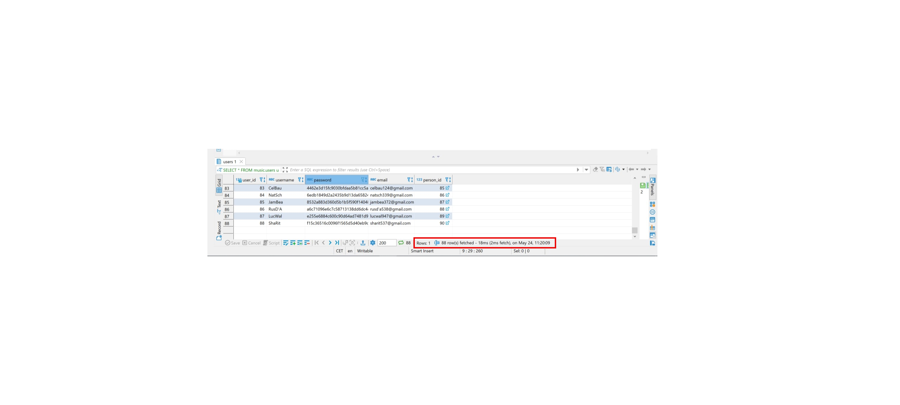
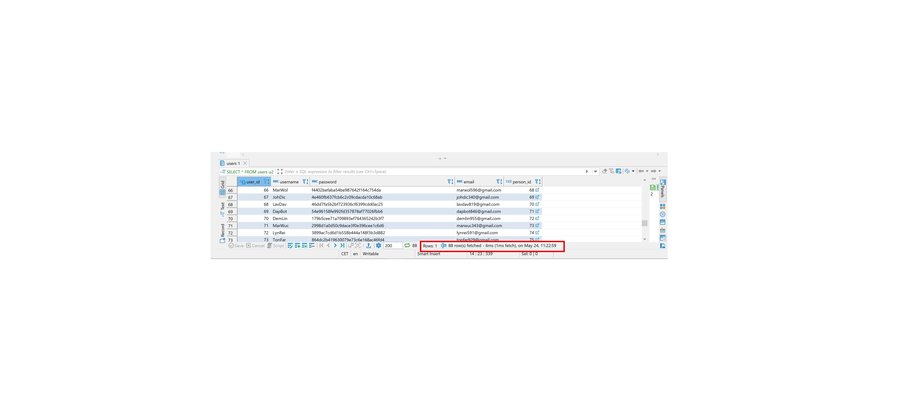

# Indexing in PostgreSQL

## Creating an index

1. Creating a table

    CREATE TABLE music.testUser  (
    testUserId				INT				GENERATED ALWAYS AS IDENTITY		UNIQUE,
    username			VARCHAR(100)	NOT NULL		UNIQUE,
    age 		INT 			NOT NULL
    );

Fetching all users (Åben billede "BeforeIndexing" hvis utydeligt)

2. Creating an index

    CREATE INDEX users_id_index ON users (user_id);

Fetching all users with indexing (Åben billede "AfterIndexing" hvis utydeligt)

## Technical breakdown

An Index is the structure or object by which we can retrieve specific rows or data faster. Indexes can be created using one or multiple columns or by using the partial data depending on your query requirement conditions.

PostgreSQL server provides following types of indexes, which each uses a different algorithm:

* B-tree
* Hash
* GiST
* SP-GiST
* GIN
* BRIN

By **default** a **B-tree** index will get created. 

1. B-tree index
The most common and widely used index type is the B-tree index. This is the default index type for the CREATE INDEX command, unless you explicitly mention the type during index creation. 

    CREATE INDEX <index_name> ON <table_name> (<column_name>);

2. Hash index
The Hash index can be used only if the equality condition = is being used in the query. 

    CREATE INDEX <index_name> ON <table_name> using HASH (<column_name>);
    select * from public."Track" where "Name"='Princess of the Dawn';

For de resterende.. læs artiklen, tror ikke vi får brug for flere og jeg gider ikke skrive mere ＼（〇_ｏ）／

    https://www.enterprisedb.com/postgres-tutorials/overview-postgresql-indexes

###Tips
1. Indexes add overhead to the database system as a whole, so they should be used sensibly.

For Example: The INSERT and UPDATE statements take more time on tables having indexes, whereas the SELECT statements become fast on those tables. The reason is that while doing INSERT or UPDATE, a database needs to insert or update the index values as well.

2. You may need to run the ANALYZE command regularly to update statistics to allow the query planner to update the decisions planner.

3. You need to maintain the index properly so that it will not get bloated. You can REINDEX or you can also re-create the index concurrently.

4. A GIN index is expected to run slower than a B-tree because of the flexibility it provides.

5. In PostgreSQL versions prior to v10, Hash indexes were not WAL-logged, so they might need to be rebuilt after a database crash, if there were any unwritten changes.

Starting with v10, WAL-logging support was added to Hash indexes, which makes them crash-safe and replicable. 

