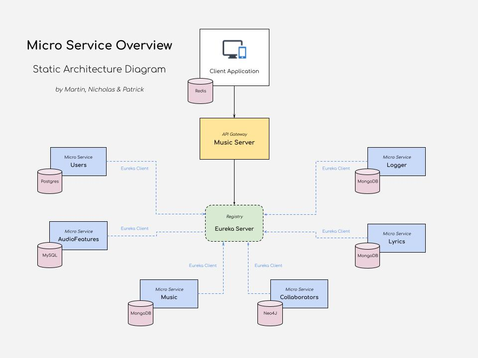
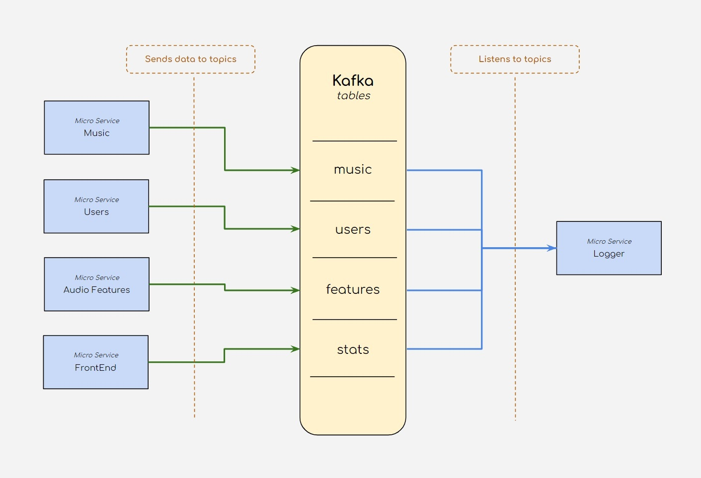
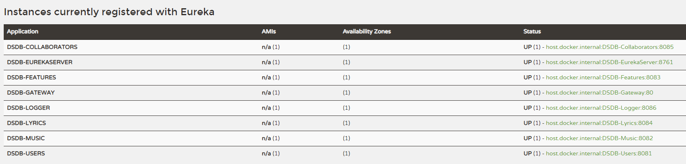

#Databases 2022 - Exam Project

**By**
* Martin Seest Holmqvist
* Nicholas Mathias Tureczek
* Patrick Picard Jønsson

# LINK TO VIDEO

## Table of Contents

## Introduction to our solution

Our project is revolving around music.\
Our vision was to create an application which can show a variety of lists and features, of all the popular songs from Spotify, based on their 
Top 200 lists from the last 10 years - along with a set of different features.

The data we use is collected from [Kaggle](https://www.kaggle.com/datasets/dhruvildave/spotify-charts), where they have a very large dataset, with approximately 21 mio songs.

These features include:
- Audio Features (Taken from the spotify api) -> [Spotify API](https://developer.spotify.com/documentation/web-api/)
- Lyrics (Scrapped from Genius.com) -> [Lyrics](https://www.genius.com)
- Collaborators (Also scrapped from Genius.com) -> [Collaborators](https://www.genius.com)

The data we use in the application is cleaned from different unused values, which includes:
- Duplicates (We just show the highest rank of a given song)
- Other values we didn't know what to use for

We store the different information from the songs in different databases, to show our ability to use them, 
and make them work together in a single frontend application.

Our Application is built of Micro Services, which is set up to be registered with a Eureka Server.\
Through the Eureka Server, our API Gateway stores the information about the different endpoints of the Micro Services - and our frontend application uses the API Gateway to serve the data in a single web application.

### Static Architecture diagram

The following image presents a Static Architecture Diagram of our application.\
The diagram below shows the connection between our services, and how they are managed through the Eureka Server.
It also serves as an overview of the different Micro Services, and which databases we use for the different Services/Applications.

### Kafka

We are using Kafka for delivering messages to our Logger Service, in order to gather different data for the
administrators of the website.

The reason we use Kafka, is to eliminate any dependency the different Micro Services would have of each other - 
if we for example stored the data directly into a database, from each Micro Service.

Kafka eliminates these dependencies, because each Micro Service deliver messages through a Kafka Server. If a Service breaks down, it just won't deliver messages - but the rest of the services will still work normally.

The messages to Kafka includes:
- Creation of new users and music entries.
- Login
- Session data about time spend and number of endpoints viewed.
- And more..

Below is an overview of how Kafka handles the different messages between our Micro Services.

## Overview of the different services:

|     Application     	| Port  	| Name                 	|
|:-------------------:	|-------	|----------------------	|
| Front End            	| 8080  	| DSDB-FrontEnd 	    |
| Gateway             	| 80      	| DSDB-Gateway      	|
| Users              	| 8081    	| DSDB-Users           	|
| Music             	| 8082  	| DSDB-Music        	|
| Audio Features       	| 8083  	| DSDB-AudioFeatures  	|
| Lyrics             	| 8084  	| DSDB-Lyrics         	|
| Collaborators        	| 8085  	| DSDB-Collaborators   	|
| Logger             	| 8086  	| DSDB-Logger       	|
| Eureka Server       	| 8761  	| DSDB-EurekaServer 	|
| Kafka Server        	| 9092  	| N/A                  	|

## Chosen technologies

Below we list the technologies we are using for this project.

|    Technology   	|                                                                                                                                                                                  Usage                                                                                                                                                                                  	|
|:---------------:	|:-----------------------------------------------------------------------------------------------------------------------------------------------------------------------------------------------------------------------------------------------------------------------------------------------------------------------------------------------------------------------:	|
|  MongoDB Compass 	| MongoDB desktop application which we use to get a look into the tables of our MongoDB database.                                                                                                                                                                                                                                                                         	|
|   IntelliJ IDEA  	| Java development environment                                                                                                                                                                                                                                                                                                                                            	|
|       Kafka      	| Used as a message broker between many of our services. We have presented an overview diagram of our Kafka system in this README                                                                                                                                                                                                                                         	|
|   Netflix Eureka 	| Used as our Microservice register, keeping tabs on our different services, and how to reach them.                                                                                                                                                                                                                                                                       	|
|      Postman     	| Used to verify the API requests and response throughout the system. Additionally it is used to start the camunda flow.                                                                                                                                                                                                                                                  	|
|      DBeaver     	| DBeaver is a universal Database Handler, which is able to hold several different connections to various databases, and thus simplifying the DB management.                                                                                                                                                                                                               	|
|   Neo4J Desktop  	|                                                                                                                                                                                                                	|

## Chosen databases

Below we are listing the databases we use in this project.

|    Databases   	|                                                                                                                                                                                  Usage                                                                                                                                                                                  	|
|:-----------------:|:-----------------------------------------------------------------------------------------------------------------------------------------------------------------------------------------------------------------------------------------------------------------------------------------------------------------------------------------------------------------------:	|
|     MongoDB      	|                       |
|    PostgreSQL   	|                       |
|      Redis      	|                       |
|      Neo4J    	|                       |
|      MySQL     	|                       |

***
## Micro Services

Below we list the different Micro Services we are using, and a brief explanation of their responsibilities.

#### DSDB-Users

#### DSDB-Music

#### DSDB-AudioFeatures

#### DSDB-Lyrics

#### DSDB-Collaborators

#### DSDB-Logger

#### DSDB-Gateway

#### DSDB-FrontEnd

#### DSDB-EurekaServer

Netflix Eureka is our application that holds the information about all client-server applications.
All the microservices in this application are registered into our Eureka server and then our Eureka server knows which port our individual service is running on - this means that we can easily create and annotate a API Gateway, which then has access to all the different Micro Services' endpoints.

As shown above, we can access this information from our Eureka server, by going to our browser http://localhost:8761/ where we can get an overview of all the servers running, the names and on what port these services are running.
***
###BCrypt

Bcrypt is a password-hashing function based on the blowfish algorithm.

We are using this library to secure the passwords of our users, by making a one way hashing on the passwords.\
This means that when a user is creating a password, it will be hashed - and can never be 'unhashed' again.\
By this way, we ensure that all users passwords remain a secret.

***
## Use Cases

***
## Database queries