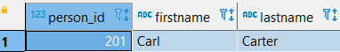

#Databases 2022 - Exam Project

**By**
* Martin Seest Holmqvist
* Nicholas Mathias Tureczek
* Patrick Picard Jønsson

# LINK TO VIDEO

## Table of Contents

## Introduction to our solution

Our project is revolving around music.\
Our vision was to create an application which can show a variety of lists and features, of all the popular songs from Spotify, based on their 
Top 200 lists from the last 10 years - along with a set of different features.

The data we use is collected from [Kaggle](https://www.kaggle.com/datasets/dhruvildave/spotify-charts), where they have a very large dataset, with approximately 21 mio songs.

These features include:
- Audio Features (Taken from the spotify api) -> [Spotify API](https://developer.spotify.com/documentation/web-api/)
- Lyrics (Scrapped from Genius.com) -> [Lyrics](https://www.genius.com)
- Collaborators (Also scrapped from Genius.com) -> [Collaborators](https://www.genius.com)

The data we use in the application is cleaned from different unused values, which includes:
- Duplicates (We just show the highest rank of a given songInfo)
- Other values we didn't know what to use for

We store the different information from the songs in different databases, to show our ability to use them, 
and make them work together in a single frontend application.

Our Application is built of Micro Services, which is set up to be registered with a Eureka Server.\
Through the Eureka Server, our API Gateway stores the information about the different endpoints of the Micro Services - and our frontend application uses the API Gateway to serve the data in a single web application.

### Static Architecture diagram

The following image presents a Static Architecture Diagram of our application.\
The diagram below shows the connection between our services, and how they are managed through the Eureka Server.
It also serves as an overview of the different Micro Services, and which databases we use for the different Services/Applications.

### Kafka

We are using Kafka for delivering messages to our Logger Service, in order to gather different data for the
administrators of the website.

The reason we use Kafka, is to eliminate any dependency the different Micro Services would have of each other - 
if we for example stored the data directly into a database, from each Micro Service.

Kafka eliminates these dependencies, because each Micro Service deliver messages through a Kafka Server. If a Service breaks down, it just won't deliver messages - but the rest of the services will still work normally.

The messages to Kafka includes:
- Creation of new users and music entries.
- Login
- Session data about time spend and number of endpoints viewed.
- And more..

Below is an overview of how Kafka handles the different messages between our Micro Services.

## Overview of the different services:

|     Application     	| Port  	| Name                 	|
|:-------------------:	|-------	|----------------------	|
| Front End            	| 8080  	| DSDB-FrontEnd 	    |
| Gateway             	| 80      	| DSDB-Gateway      	|
| Users              	| 8081    	| DSDB-Users           	|
| Music             	| 8082  	| DSDB-Music        	|
| Audio Features       	| 8083  	| DSDB-AudioFeatures  	|
| Lyrics             	| 8084  	| DSDB-Lyrics         	|
| Collaborators        	| 8085  	| DSDB-Collaborators   	|
| Logger             	| 8086  	| DSDB-Logger       	|
| Eureka Server       	| 8761  	| DSDB-EurekaServer 	|
| Kafka Server        	| 9092  	| N/A                  	|

## Chosen technologies

Below we list the technologies we are using for this project.

|    Technology   	|                                                                                                                                                                                  Usage                                                                                                                                                                                  	|
|:---------------:	|:-----------------------------------------------------------------------------------------------------------------------------------------------------------------------------------------------------------------------------------------------------------------------------------------------------------------------------------------------------------------------:	|
|  MongoDB Compass 	| MongoDB desktop application which we use to get a look into the tables of our MongoDB database.                                                                                                                                                                                                                                                                         	|
|   IntelliJ IDEA  	| Java development environment                                                                                                                                                                                                                                                                                                                                            	|
|       Kafka      	| Used as a message broker between many of our services. We have presented an overview diagram of our Kafka system in this README                                                                                                                                                                                                                                         	|
|   Netflix Eureka 	| Used as our Microservice register, keeping tabs on our different services, and how to reach them.                                                                                                                                                                                                                                                                       	|
|      Postman     	| Used to verify the API requests and response throughout the system. Additionally it is used to start the camunda flow.                                                                                                                                                                                                                                                  	|
|      DBeaver     	| DBeaver is a universal Database Handler, which is able to hold several different connections to various databases, and thus simplifying the DB management.                                                                                                                                                                                                               	|
|   Neo4J Desktop  	| Neo4j is a graph database which consists of nodes and relationships between these nodes.                                                                                                                                                                                                                	|

## Chosen databases

Below we are listing the databases we use in this project.

|  Databases |    Genre   |                                                                                                                                 Usage                                                                                                                                | 
|:----------:|:---------:|:--------------------------------------------------------------------------------------------------------------------------------------------------------------------------------------------------------------------------------------------------------------------:|
|   MongoDB  |  Document |                                             We use MongoDB to store Lyrics our songs, and the artist preforming the songInfo. besides that we use mongo to  store our log files, which can be accessed by the administrator.                                             | 
| PostgreSQL |Relational |                                                                                                       In PostgreSQL we are storing our users and the userInfo data. We are also using it to store Audio Features for the songs.                                                                                                     | 
|    Redis   | Key/Value |                                                                                           Redis is used as a cache calls to the database on top of our client application.                                                                                           |  
|    Neo4J   |   Graph   |                                      Neo4j is containing nodes with track name, with various relationships to the writers, producers, artists nodes.  These relationships is called [SANG], [COLLABORATED], [WROTE] and [FEATURED]                                     |

 
 
 

***
## Micro Services

- Below we list the different Micro Services we are using, and a brief explanation of their responsibilities.

#### DSDB-Users
- This service is handling all transaction regarding users and makes sure the users' login credentials are correct in terms of password and username. 

#### DSDB-Music
- The DSDB-Music service is managing all calls to the MongoDB regarding the Track and artists related to the specific songInfo.

#### DSDB-AudioFeatures
- Here we are managing all transactions happening to and from the Postgres database table 'features', which contains all the Audio features.

#### DSDB-Lyrics
- As the name implies, the DSDB-Lyric is responsible for handling the transactions we are running to get the lyrics of the songs.

#### DSDB-Collaborators
- This microservice is making sure we can deliver the collaborators on the individual tracks for the songs we are presenting through our other microservices.

#### DSDB-Logger
- In DSDB-Logger, we are managing the log files which can be presented to the administrators if requested. 

#### DSDB-Gateway
- This is more or less an empty shell which works as a middle man between our Eurika server, and our client application. 

#### DSDB-FrontEnd
- DSDB_FrontEnd has the responsibility of presenting the graphical userInfo interface to the guest, userInfo or administrator using our program.

#### DSDB-EurekaServer

Netflix Eureka is our application that holds the information about all client-server applications.
All the microservices in this application are registered into our Eureka server and then our Eureka server knows which port our individual service is running on - this means that we can easily create and annotate a API Gateway, which then has access to all the different Micro Services' endpoints.

As shown above, we can access this information from our Eureka server, by going to our browser http://localhost:8761/ where we can get an overview of all the servers running, the names and on what port these services are running.
***
###BCrypt

Bcrypt is a password-hashing function based on the blowfish algorithm.

We are using this library to secure the passwords of our users, by making a one way hashing on the passwords.\
This means that when a user is creating a password, it will be hashed - and can never be 'unhashed' again.\
By this way, we ensure that all users passwords remain a secret.

***
## Use Case Diagram

Here we are showing an overview of the use cases we have implemented in our program.

### Use Cases

***
## Database queries

### MongoDB
When getting lyrics from our MongoDB database, we sometimes want to get more than just a single lyric.
When this is the case, we are creating a list of id's and a function to return this.
The following is an example on how this works:

    var ids = [16,17];
    var lyric_ids = ids.map(function(id) { return id; });
    db.lyrics.find({songId: {$in: obj_ids}});

MongoDB's native tongue is JavaScript, which allows us to make variables like we have done in the 
previous example. 
Here the database returns the lyric which corresponds to the id's inserted in our list.

    db.log.find({$where: "this.date > 2022-05-20 && this.date < 2022-05-26 ",
    call: /READ/ })

The above query is used in our logging service, to find a specific call to our database. In this example, we are searching for 
all the "reads" from the database between 20th of May 2022 and the 26th of May 2022.

Furthermore, in the future we want to get some statistics on the use of our webpage. To do this, we want to be able to present to the administrators
how much time our users have been spending on our page.
We do this by using MongoDb's aggregate function, alongside matching it with a $match, $gte and $lt, to be able to determine 
what time frame this should be presented for. The code snippet shown below are showing how this is done.

      var start = "2022-xx-xx"
      var end = "2022-xx-xx"
      
      db.log.aggregate([
         {
            $match: {
               'start': {
                  $gte: ISODate(start), $lt: ISODate(end)
               }
            }
         },
         {
            $set: {
               Duration: {
                  $dateToString: {
                     date: {
                        $dateFromParts: {
                           year: 1970,
                           millisecond: { $subtract: [ "$end", "$start" ] }
                        }
                     },
                     format: "%H:%M:%S"
                  }
               }
            }
         }
      ]);

***

### Neo4j
First thing first, we have to populate our database. This is done by our web scraper to scrape web page "https://genius.com" for information
about the songs and collaborators on the songs. here we get writers, producers and featuring artists.
Hereafter we store these informations in a .csv file and load them into our Neo4j graph database with the apoc library.

    CALL apoc.load.csv('collaborators.csv')
    YIELD lineNo, map, list
    
    WHERE map.Feature IS NOT NULL
    MERGE (f:Person {name:map.Feature})
    MERGE (a:Person {name:"'''+ artist + '''"})
    MERGE (w:Person {name:map.Writer})
    MERGE (p:Person {name:map.Producer})
    MERGE (l:Label {name:map.Label})
    MERGE (s:Song {name:"'''+ track +'''", rank: "'''+ ranking + '''"})
    
    
    MERGE (f)-[:COLLABORATED]-(a)
    MERGE (f)-[:FEATURED]->(s)
    MERGE (a)-[:SANG]->(s)
    MERGE (w)-[:WROTE]->(s)
    MERGE (l)-[:RELEASED]->(s)
    MERGE (p)-[:PRODUCED]->(s);

When we look at our neo4j graph, we are interested in seeing who is working with whom, and what people are collaborating a lot.
First we are going to create our projection.

    CALL gds.graph.project.cypher(
        'artists',
        'MATCH (p:Person) RETURN id(p) AS id',
        'MATCH (p:Person)-[r:COLABORATED]->(m:Person) RETURN id(p) AS source, id(m) AS target')
    YIELD
        graphName AS graph, nodeQuery, nodeCount AS nodes, relationshipQuery, relationshipCount AS rels
This query will create our graph projection. and via the YIELD command return the following:

 
We can also check all of our graph projections by using:

    CALL gds.graph.list()

After we've created our projection, we can take a look closer to our data in our database.

    CALL gds.degree.stream('artists')
    YIELD nodeId, score
    RETURN gds.util.asNode(nodeID).name AS name, score AS collaborators
    ORDER BY collaborators DESC, name DESC
This tells us who has been collaborator with most different people\

We can also see who is a popular person for others to collaborate with

    CALL gds.degree.stream(
        'artists',
        {orientation: 'REVERSE' }
    )
    YIELD nodeID, score
    RETURN gds.util.asNode(nodeId).name AS name, score AS collaborators
    ORDER BY collaborators DESC, name DESC

We can see that "Drake" do almost have an equal amount of in and uot collaborators. The same is the case with "Young Thug",
but the placement on the list is different.

The following picture is showing the above two queries in a graph visualization:\

As can be seen "Young Thug" has 6 other artists who have collaborated with him, where "Young Thug" has collaborated with 5 other artist.

We can also see a triangle of what artist have collaborated the most. First we make a graph projection:

    CALL gds.graph.project(
    'Triangle',
    'Person',
    {COLLABORATED: {orientation: 'UNDIRECTED'}})

Then we are counting the numbers of triangles in our graph database:

    CALL gds.triangleCount.stream('Triangle')
    YIELD nodeId, triangleCount
    RETURN gds.util.asNode(nodeId).name AS name, triangleCount
    ORDER BY triangleCount DESC

This gives us the following overview:\

By using the "Triangle" graph projection, we can also see who is in the triangles:

    CALL gds.alpha.triangles('Triangle')
    YIELD nodeA, nodeB, nodeC
    RETURN
    gds.util.asNode(nodeA).name AS nodeA,
    gds.util.asNode(nodeB).name AS nodeB,
    gds.util.asNode(nodeC).name AS nodeC

As shown by the triangleCount, "Boef" has the most triangle connections. Hereafter we can see with whom.

***

### Redis

***

### PostgreSQL

We want to demonstrate later on how indexing can help speed up the search for a specific user in our PostgreSQL database,
so first off, we want to populate our PostgreSQL with users.

    INSERT INTO person (first_name, last_name, gender) VALUES
    ('Florrie','Wilson','Female'),
    ('Oscar','Fowler','Male'),
    ('Ada','Parker','Female'),
    ('Agata','Richards','Female'),
    ...
    ...
    ... );

We want to add a birthdate to each person in our table. To do this, we build a function that runs a loop on the 200 inserted 
users in our database. Here we give each user a birthdate, and an age corresponding to the date of birth.

    do $$
    begin
        for counter in 1..200 LOOP
        UPDATE person SET birth_date = (timestamp '1922-01-10' + random() * (timestamp '2022-01-01' - timestamp '1922-01-01'))::DATE WHERE person_id = counter;
        UPDATE person p SET age = (current_date - CAST(p.birth_date AS date))/365;
    end loop;
    end; $$

We do not feel that we are able to show the potential of indexing our users with only 200 entries in our database, this is why we 
now want to create additional 20000 users by randomly selecting first_names of the already existing users in our database, and mixing them
with random last_names of our users.

Firstly we get the first_name.

    CREATE OR REPLACE FUNCTION randomFirstnameFromList()
    RETURNS TEXT AS
    $$
        SELECT first_name FROM person ORDER BY random();
    $$
    LANGUAGE 'sql'
    VOLATILE;

Then creating a function to get a random last_name.

    CREATE OR REPLACE FUNCTION randomLastnameFromList()
    RETURNS TEXT AS
    $$
        SELECT last_name FROM person ORDER BY random();
    $$
    LANGUAGE 'sql'
    VOLATILE;

Naturally we also need to add birthdays to the new users.

    CREATE OR REPLACE FUNCTION randomDate()
    RETURNS DATE AS
    $$
        SELECT (timestamp '1922-01-10' + random() * (timestamp '2022-01-01' - timestamp '1922-01-01'))::DATE;
    $$
    LANGUAGE 'sql'
    VOLATILE;

Then we add the new users to our already existing database with people.

    DO
    $$
    BEGIN
        FOR counter IN 1..20000
        LOOP
        INSERT INTO person (firstname, lastname, birthdate) VALUES (randomFirstnameFromList(), randomLastnameFromList(), randomDate());
    END LOOP;
    END;
    $$

#### Log directly in PostgreSQL

We are creating a trigger which will be activated everytime a user is updated in our database.

First we are creating a new table called "logs", and we are making a timestamp on the giving time a user is updated.

    CREATE TABLE logs (
    person_id integer,
    old_firstname varchar(50),
    old_lastname varchar(50),
    LOGGED_at timestamp DEFAULT current_timestamp);

Then we create the function to be triggered when an update is made.

    CREATE OR REPLACE FUNCTION log_event() RETURNS TRIGGER AS $$
    DECLARE
    BEGIN
        INSERT INTO logs (person_id, old_firstname, old_lastname)
        VALUES (OLD.person_id, OLD.firstname, OLD.lastname);
    RAISE NOTICE 'Someone just changed person #%', OLD.person_id;
    RETURN NEW;
    END;
    $$ LANGUAGE plpgsql;

Lastly we create the trigger that is to be run on a given event. In this case "UPDATE".

    CREATE TRIGGER log_event 
    AFTER UPDATE ON person
    FOR EACH ROW EXECUTE PROCEDURE log_event();

If we take a look at our person table, we can see a person with an id 201. We want to update the lastname of the person
to "Simonsen".

When running the following query, we should automatically insert a new entry into our log table.

    UPDATE person 
    SET lastname ='Simonsen'
    WHERE person_id  = 201;

we get the following output from Dbeaver.

We can see that the log has inserted the old name of our user with person_id 201

and if we call the user on our person table, we can see that this has been changed.

#### Creating index in PostgreSQl

Creating an index

    CREATE INDEX users_id_index ON users (user_id);

Fetching all users with indexing (Åben billede "AfterIndexing" hvis utydeligt)

## Technical breakdown

An Index is the structure or object by which we can retrieve specific rows or data faster. Indexes can be created using one or multiple columns or by using the partial data depending on your query requirement conditions.

PostgreSQL server provides following types of indexes, which each uses a different algorithm:

* B-tree
* Hash
* GiST
* SP-GiST
* GIN
* BRIN

By **default** a **B-tree** index will get created.

1. B-tree index
   The most common and widely used index type is the B-tree index. This is the default index type for the CREATE INDEX command, unless you explicitly mention the type during index creation.

    CREATE INDEX <index_name> ON <table_name> (<column_name>);

2. Hash index
   The Hash index can be used only if the equality condition = is being used in the query.

    CREATE INDEX <index_name> ON <table_name> using HASH (<column_name>);
    select * from public."Track" where "Name"='Princess of the Dawn';

